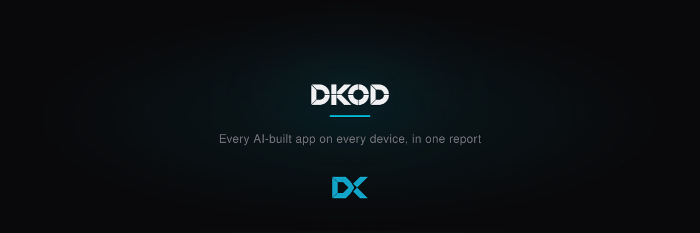

<p align="center">
  <a href="https://dkod.ai">
    <picture>
      <source media="(prefers-color-scheme: dark)" srcset=".github/assets/banner-dark.svg">
      
    </picture>
  </a>
</p>

<p align="center">
  <b>The device scanner for shadow AI apps. One binary, one run, one metrics-only report.</b>
</p>

<p align="center">
  <a href="LICENSE"></a>
  <a href="https://github.com/dkod-ai/dkod-signals-releases/releases"></a>
  
  
  
  <a href="https://dkod.ai"></a>
</p>

<p align="center">
  <a href="#install">Install</a> &nbsp;&bull;&nbsp;
  <a href="#what-it-does">What It Does</a> &nbsp;&bull;&nbsp;
  <a href="#mdm-deployment">MDM Deployment</a> &nbsp;&bull;&nbsp;
  <a href="#privacy-contract">Privacy Contract</a> &nbsp;&bull;&nbsp;
  <a href="#exit-codes">Exit Codes</a> &nbsp;&bull;&nbsp;
  <a href="#verify-a-download">Verify</a>
</p>

<br>

This repository holds the **release packages** of `dkod-signals` and the
installer that fetches them. Every release ships the same six files: a
`.tar.gz` for macOS (Apple Silicon and Intel) and Linux (x86_64 and arm64), a
`.zip` for Windows (x86_64), and a `SHA256SUMS` file the installer checks
before it installs anything.

`dkod-signals` is a single static binary that IT admins distribute via MDM
(Jamf, Intune, Kandji, …) to every macOS / Windows / Linux device in an
organization. It runs **once**, at **low priority**, inventories the AI-built
apps on that device, computes **metrics-only** signals per app, writes **one
JSON report**, and exits.

**It never executes anything it finds, never modifies scanned repos, and never
writes outside its output directory.** The report goes to disk. With
`--upload` it also goes, over HTTPS, to the dkod dashboard your organization
uses, under an ingest token you issue. There is no other network access.

<br>

## Install

macOS and Linux, one line, as root for a fleet install (the binary lands in
`/usr/local/bin/dkod-signals`):

```sh
curl -fsSL https://raw.githubusercontent.com/dkod-ai/dkod-signals-releases/main/install.sh | sh
```

Pin a version, or install somewhere else:

```sh
curl -fsSL https://raw.githubusercontent.com/dkod-ai/dkod-signals-releases/main/install.sh | VERSION=v0.1.29 PREFIX=/opt/dkod sh
```

The installer detects the OS and CPU, downloads the matching package and
`SHA256SUMS` from the [latest release](https://github.com/dkod-ai/dkod-signals-releases/releases/latest),
verifies the checksum, and installs the binary. It never runs `dkod-signals`
and never sends anything anywhere.

Windows: download `dkod-signals-<version>-x86_64-pc-windows-msvc.zip` from the
[releases page](https://github.com/dkod-ai/dkod-signals-releases/releases),
verify it against `SHA256SUMS` (see [Verify a download](#verify-a-download)),
and place `dkod-signals.exe` in `C:\Program Files\dkod-signals\`. The Intune
script from your dkod dashboard does exactly this for you.

Then, on any OS:

```sh
dkod-signals version
dkod-signals scan --all-users --quiet        # writes the report, prints nothing else
dkod-signals explain <app-name>              # the rules behind one app's score
```

<br>

<table>
<tr>
<td width="50%" valign="top">

### 🔎 Discovers

Reads the local state of every AI coding tool — **Claude Code, Cursor, Codex,
Gemini CLI, Copilot CLI, opencode, Factory** — to learn which projects an
agent worked in (high confidence), and walks the home directory for AI markers
like `CLAUDE.md` / `.cursorrules` (medium). A project root with no agent session
and no marker is not an AI-built app, and is never reported as one.

Only paths and timestamps are read from agent state — **never prompts, never
session content**.

</td>
<td width="50%" valign="top">

### 📐 Measures

Seven analyzers, each pure over a sandboxed view of the project (bounded reads,
no symlink escape, hard time slice):

`stack` · `git` · `secrets` · `auth` · `exposure` · `data` · `activity`

Frameworks, remote host class, secret-shaped strings (**counts only**),
authentication method, deploy markers, open binds, DB/cloud/SaaS/LLM SDKs,
agent sessions and recency.

</td>
</tr>
<tr>
<td width="50%" valign="top">

### 🎯 Scores

A transparent, additive rule table — **every fired rule is emitted with the
app** — bands each app into `low / medium / high / critical`, and a `dkod_fit`
verdict says whether the app could be rebuilt safely inside a governed
pipeline, and if not, exactly why.

`dkod-signals explain <app>` shows the rules behind any number.

</td>
<td width="50%" valign="top">

### 🔒 Never leaks

The report carries **no paths, no URLs, no secrets, no commit messages, no
prompts, no emails, no command lines**. Every string field is checked against
an allowlist by a test; an end-to-end test plants all seven banned content
classes and asserts none survive.

Budgets are hard: wall clock, RSS, per-app slice, per-file cap. **A partial
report always beats no report.**

</td>
</tr>
</table>

<br>

## What it does

<p>
  <kbd>&nbsp; Claude Code &nbsp;</kbd>&nbsp;
  <kbd>&nbsp; Cursor &nbsp;</kbd>&nbsp;
  <kbd>&nbsp; Codex &nbsp;</kbd>&nbsp;
  <kbd>&nbsp; Gemini CLI &nbsp;</kbd>&nbsp;
  <kbd>&nbsp; Copilot CLI &nbsp;</kbd>&nbsp;
  <kbd>&nbsp; opencode &nbsp;</kbd>&nbsp;
  <kbd>&nbsp; Factory droid &nbsp;</kbd>&nbsp;
  <kbd>&nbsp; Aider / Windsurf / Cline (markers) &nbsp;</kbd>
</p>

One run, four steps, then exit:

1. **Discover.** Every user's home on the device (`--all-users`, needs
   root/SYSTEM) is walked for AI agent state and AI markers. Candidates are
   project roots, never single files.
2. **Measure.** Each candidate gets the seven analyzers, inside a time slice
   and a memory budget. A slow or huge project loses its slice, not the whole
   run.
3. **Score.** The rule table bands each app and records which rules fired.
4. **Report.** One JSON file, schema version 2, written atomically and
   `0600` on unix. With `--upload`, the same bytes are POSTed to your dkod
   dashboard's `/api/v1/ingest` under your ingest token. The organization the
   report lands in is decided by that token on the server; the request
   carries no organization field, so a device cannot report into someone
   else's org. Plain `http://` is refused and redirects are never followed.

An optional raw-report mirror can also PUT the report into an S3-compatible
bucket in **your own** cloud account (`--bucket`, plus key and secret with
`s3:PutObject`). Leave it unset and no mirror happens. Set it and forget the
credentials, and the scan refuses to start rather than run for fifteen minutes
and fail at the end.

<br>

## MDM deployment

Your dkod dashboard generates ready-to-paste scripts under **Settings →
MDM snippets**: a Jamf policy script (macOS), an Intune platform script
(Windows) and a shell script for Linux (Ansible, cron, any RMM). Each one:

1. installs `dkod-signals` from this repository if the device does not have it,
   checksum verified;
2. runs `dkod-signals scan --all-users` as root/SYSTEM;
3. uploads the report to your dashboard, best-effort: a failed upload is logged
   to the MDM and never changes the scan's exit code, so an off-VPN laptop is
   visible rather than silently lost.

Two values go into every script, and nothing else is needed:

| Value | Where it comes from |
|---|---|
| Ingest token | Dashboard → **Settings → Tokens → Create**. One per fleet. Shown once. Revoke it to stop every device that uses it |
| Org salt | Any private word for your organization, e.g. `acme-2026`. Mixed into `device_id` so ids are stable inside your org and meaningless outside it. Set as `DKOD_SIGNALS_SALT` in the environment, never on the command line |

Run it **weekly**. The dashboard keeps the latest report per device, so a
faster cadence buys nothing and costs battery on every laptop at once.

Every flag also has a `DKOD_SIGNALS_*` environment variable, so an MDM policy
can stay a one-line invocation with its configuration in the environment. The
ones a fleet policy touches:

| Flag | Env var | Default | Meaning |
|---|---|---|---|
| `--all-users` | `DKOD_SIGNALS_ALL_USERS` | `false` | Scan every user's home, not just the current one |
| `--out <DIR>` | `DKOD_SIGNALS_OUT` | OS app-data dir | Directory to write the report into |
| `--salt <STR>` | `DKOD_SIGNALS_SALT` | — | Org salt mixed into `device_id` and the hostname hash |
| `--upload` | `DKOD_SIGNALS_UPLOAD` | `false` | Send the report to a dashboard after writing it |
| `--upload-url <URL>` | `DKOD_SIGNALS_INGEST_URL` | — | Dashboard URL. Must be `https://` |
| `--token <TOKEN>` | `DKOD_SIGNALS_INGEST_TOKEN` | — | Ingest token. Prefer the env var: arguments are world-readable |
| `--budget-secs <N>` | `DKOD_SIGNALS_BUDGET_SECS` | `900` | Wall-clock budget for the whole run, seconds |
| `--budget-mb <N>` | `DKOD_SIGNALS_BUDGET_MB` | `400` | Resident memory budget, MB |
| `--bucket <NAME>` | `DKOD_SIGNALS_BUCKET` | optional | Also mirror the raw report into your own S3-compatible bucket; then `--bucket-key` and `--bucket-secret` are required |
| `--quiet` | `DKOD_SIGNALS_QUIET` | `false` | Suppress the summary line |

Default output directory when run as root/SYSTEM:

| OS | Report |
|---|---|
| macOS | `/Library/Application Support/dkod-signals/dkod-signals-report.json` |
| Linux | `/var/lib/dkod-signals/dkod-signals-report.json` |
| Windows | `%ProgramData%\dkod-signals\dkod-signals-report.json` |

<br>

## Privacy contract

The report is metrics-only. It never contains:

- Absolute or relative file paths.
- Remote URLs (git remotes are reduced to a host *class* — github / gitlab /
  bitbucket / azure / self-hosted / none — never the URL itself).
- Secret matches (only hit *counts* by rule kind).
- Commit messages, or any git content beyond aggregate stats.
- Prompt or session content from any AI tool (only path + timestamp are read
  from agent state, and paths themselves never reach the report as free
  text).
- Emails or process command lines.
- Skill bodies, hook command lines or prompts, MCP server URLs, arguments or
  environment values. Extensions are reduced to a kind, a command *class*
  (`npx`, `docker`, `shell`, ...), a host class (`localhost` / `remote`) and
  fixed trait strings.

The only free text allowed in the report is: app `name` (basename or package
name, sanitized), OS usernames and their account display names (sanitized;
suppress with `--no-display-names`), skill and MCP server names (sanitized),
framework and vendor names drawn from the scanner's own embedded tables, and
its own rule messages. Everything else is passed through a sanitizer before it
can reach a report field, and a CI test builds a report from an adversarial
fixture (paths, secrets, URLs and prompts planted everywhere) and asserts none
of it survives.

`device_id` is `sha256(platform machine-id + salt)`. Without a salt the id is
comparable across every device dkod-signals has ever scanned anywhere, not
just your fleet — always set an org salt in production. The hostname is hashed
unless `--emit-hostname` is set.

<br>

## Exit codes

| Code | Meaning |
|---|---|
| `0` | A report was written, including a partial report (flagged inside the report itself). Findings never affect the exit code: a device with nine critical apps and a device with none both exit `0`. |
| `1` | `explain`: the report is missing, unreadable, or not valid JSON, or no app matches the given name. |
| `2` | Bad arguments, or a `--bucket` with missing credentials: the scan never started. |
| `3` | The report could not be written anywhere at all, not even the temporary-directory fallback. |
| `4` | `scan --upload`: the report was written but could not be uploaded to the dashboard. The scan itself is fine; check the network or the token. |
| `5` | The report was written but could not be mirrored into the bucket. The scan itself is fine; check the bucket credentials or the network. |

MDM should alert on these differently. They are different problems.

<br>

## Verify a download

Every release carries `SHA256SUMS`. The installer checks it for you; to check
by hand:

```sh
# macOS / Linux
shasum -a 256 -c SHA256SUMS --ignore-missing
```

```powershell
# Windows
(Get-FileHash .\dkod-signals-<version>-x86_64-pc-windows-msvc.zip -Algorithm SHA256).Hash
# compare with the matching line in SHA256SUMS
```

<br>

## License

The packages here are proprietary. Use requires a dkod subscription, trial or
pilot agreement. See [LICENSE](LICENSE). Questions: legal@dkod.ai.
